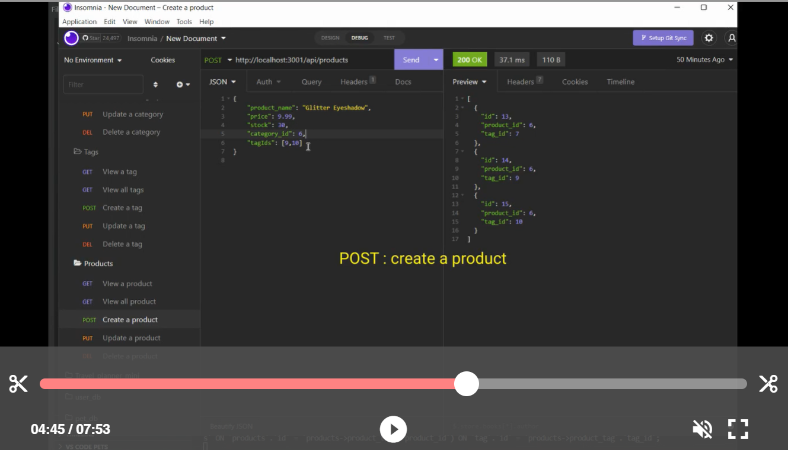

# e-commerce-back-end

## Description
This application is a back end for an e-commerce site using Express and Sequelize to interact with MySQL database.

## Table of Contents

- [Installation](#installation)
- [Usage](#usage)
- [Credit](#credit)
- [Questions](#questions)

## Installation
To use this application, you will need Node.js and several other npm packages installed, express, mysql2, dotenv, and sequelize. On your desired folder to locate the app, pull down the Repo into your computer by following line on your terminal  

    $ git clone git@github.com:morisky78/e-commerce-back-end.git

Go on [official Node.js website](https://nodejs.org/) and download the installer. 

Then install the npm package dependencies by following command

    $ npm install

Then, you will see node_modules folder has been created on your folder. 
Create a .env file to store your local database information such as following:
```
DB_NAME='ecommerce_db'
DB_USER='root'
DB_PASSWORD='your_password'
```
Create the schema from the MySQL shell : `SOURCE db/schema.sql` 

## Usage
Seed the data and run the server from the command line 
```
npm run seed
npm run watch
```

The following video shows the demonstration of the functionality of the e-commerce back end, showing the process of retrieve, create, update and delete data of categories, products, and tags in your database.
https://drive.google.com/file/d/1PeMOtrrXt_T6eYQ2TCQcdINmE57iO0kt/view


[](https://drive.google.com/file/d/1PeMOtrrXt_T6eYQ2TCQcdINmE57iO0kt/view "Demonstration video screen shot")


## Credit
- sequelize
https://www.npmjs.com/package/sequelize

- npm dotenv
https://www.npmjs.com/package/dotenv

- npm mysql2
https://www.npmjs.com/package/mysql2


## Questions

If you have any questions, please contact me moran.risk78@gmail.com  
GitHub  profile: [morisky78](https://github.com/morisky78)